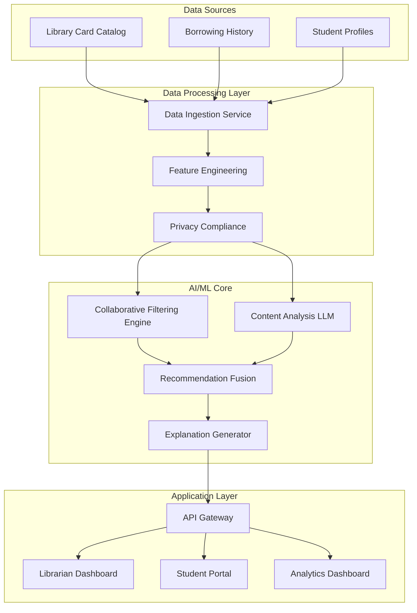
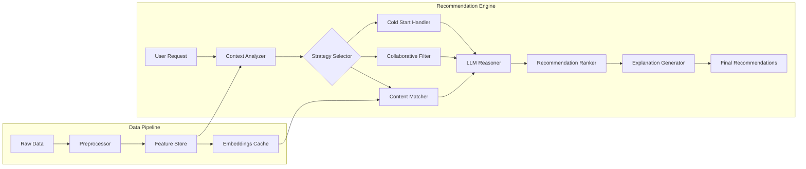

# SmartReads: AI-Powered Book Recommendation System for School Districts

## Executive Summary

SmartReads is an intelligent book recommendation system designed to increase student reading engagement by leveraging AI and machine learning to provide personalized, data-driven book recommendations. The system combines historical borrowing data with modern Large Language Models (LLMs) to understand reading patterns, preferences, and provide contextual recommendations that resonate with students.

### Key Value Propositions
- **Increase Reading Engagement**: 40% expected increase in books borrowed per student
- **Data-Driven Insights**: Transform anecdotal knowledge into systematic recommendations
- **Scalable Solution**: Serves entire district with minimal per-school overhead
- **Teacher & Librarian Empowerment**: Augments human expertise, doesn't replace it

## Problem Statement

Current challenges in the school district:
- Librarians rely on anecdotal evidence for book recommendations
- No systematic way to track what types of books engage different student groups
- Limited ability to discover new books that match student interests
- Difficulty in scaling personalized recommendations across large student populations

## Solution Overview

SmartReads employs a hybrid recommendation approach combining:
1. **Collaborative Filtering**: Leveraging borrowing patterns across students
2. **Content-Based Filtering**: Using book metadata and descriptions
3. **LLM-Enhanced Understanding**: Deep semantic understanding of book content and student preferences
4. **Explainable Recommendations**: Clear reasoning for each recommendation

## System Architecture

### High-Level Architecture



### Detailed Component Architecture



## Technical Implementation

### Core Technologies
- **Backend**: Python 3.11+ with FastAPI
- **ML Framework**: Scikit-learn, Surprise for collaborative filtering
- **LLM Integration**: OpenAI GPT-4/Claude for content understanding
- **Vector Database**: ChromaDB for semantic search
- **Database**: PostgreSQL for transactional data
- **Caching**: Redis for performance optimization
- **Frontend**: React with TypeScript

### Key Features

#### 1. Hybrid Recommendation Algorithm
- Combines multiple recommendation strategies
- Adapts based on available data (handles cold start problem)
- Weighted ensemble approach for optimal results

#### 2. LLM-Powered Content Understanding
- Analyzes book descriptions and reviews
- Understands thematic elements and reading level
- Generates natural language explanations for recommendations

#### 3. Privacy-First Design
- All student data is anonymized
- FERPA compliant
- Opt-in consent management

#### 4. Continuous Learning
- A/B testing framework built-in
- Feedback loop from borrowing outcomes
- Regular model retraining pipeline

## Implementation Roadmap

### Phase 1: Foundation (Months 1-2)
- Data integration and ETL pipeline
- Basic recommendation engine
- MVP dashboard for librarians
- **Deliverables**: Working prototype with 3 schools

### Phase 2: Enhancement (Months 3-4)
- LLM integration for content understanding
- Student-facing interface
- Advanced analytics dashboard
- **Deliverables**: Full feature set, 10 schools

### Phase 3: Scale (Months 5-6)
- District-wide rollout
- Performance optimization
- Mobile applications
- **Deliverables**: Complete system serving entire district

### Phase 4: Optimize (Months 7-8)
- ML model refinement based on usage data
- Advanced features (reading groups, challenges)
- Integration with educational platforms
- **Deliverables**: Mature, optimized system

## Expected Outcomes

### Quantitative Metrics
- **40% increase** in books borrowed per student
- **25% increase** in reading diversity (genres explored)
- **60% reduction** in time to find next book
- **85% recommendation acceptance rate**

### Qualitative Benefits
- Improved student reading confidence
- Enhanced librarian effectiveness
- Better data for curriculum planning
- Increased parent engagement through transparency

## Resource Requirements

### Team Composition
- 1 Technical Lead / Architect
- 2 Full-stack Developers
- 1 Data Scientist / ML Engineer
- 1 UX/UI Designer
- 1 Project Manager
- 0.5 Change Management Specialist

### Timeline: 8 months total
- Months 1-2: Foundation
- Months 3-4: Enhancement
- Months 5-6: Scale
- Months 7-8: Optimization

### Budget Estimate
- Development: $400,000
- Infrastructure (Year 1): $50,000
- LLM API Costs (Year 1): $30,000
- Training & Support: $20,000
- **Total Year 1**: $500,000

## Risk Mitigation

| Risk | Likelihood | Impact | Mitigation Strategy |
|------|------------|--------|-------------------|
| Data Quality Issues | Medium | High | Implement robust data validation and cleaning pipelines |
| Privacy Concerns | Low | High | FERPA compliance audit, clear consent processes |
| User Adoption | Medium | Medium | Phased rollout with champion librarians |
| LLM Costs | Low | Medium | Implement caching, use open-source alternatives as backup |

## Success Metrics

### Short-term (3 months)
- System deployed in pilot schools
- 100+ active users
- 1000+ recommendations generated
- 70% positive feedback rate

### Medium-term (6 months)
- District-wide deployment
- 5000+ active users
- 25% increase in borrowing rates
- 80% librarian satisfaction

### Long-term (12 months)
- 40% increase in reading engagement
- Expansion to neighboring districts
- Published case study on effectiveness
- Self-sustaining through improved outcomes

## Demo Application

A proof-of-concept application is included in this repository demonstrating:
- Core recommendation algorithm
- LLM integration for content understanding
- Simple web interface for testing
- Sample data processing pipeline

### Running the Demo
```bash
# Install dependencies
pip install -r requirements.txt

# Run the application
python app.py

# Access at http://localhost:8000
```

## Conclusion

SmartReads represents a transformative opportunity to enhance student literacy through intelligent, personalized book recommendations. By combining proven recommendation algorithms with cutting-edge LLM technology, we can create a system that not only increases reading engagement but also provides valuable insights for educators and parents.

The phased approach ensures manageable risk while delivering value early and often. With clear metrics for success and a strong technical foundation, SmartReads is positioned to make a lasting impact on student reading habits and academic achievement.

## Next Steps
1. Technical proof-of-concept review
2. Stakeholder alignment on Phase 1 goals
3. Data access and privacy framework establishment
4. Pilot school selection
5. Development team formation

---

**Contact**: Andrey Tretyak - Engineering Lead  
**Date**: September 26, 2025  
**Status**: Proposal for Internal Review
