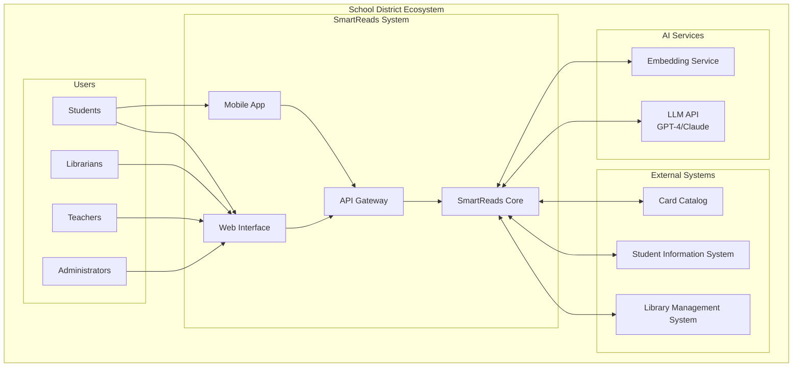
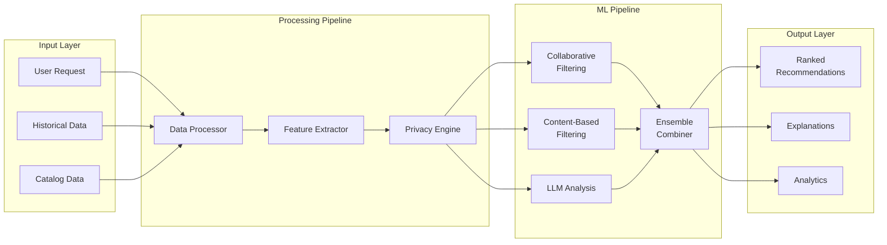
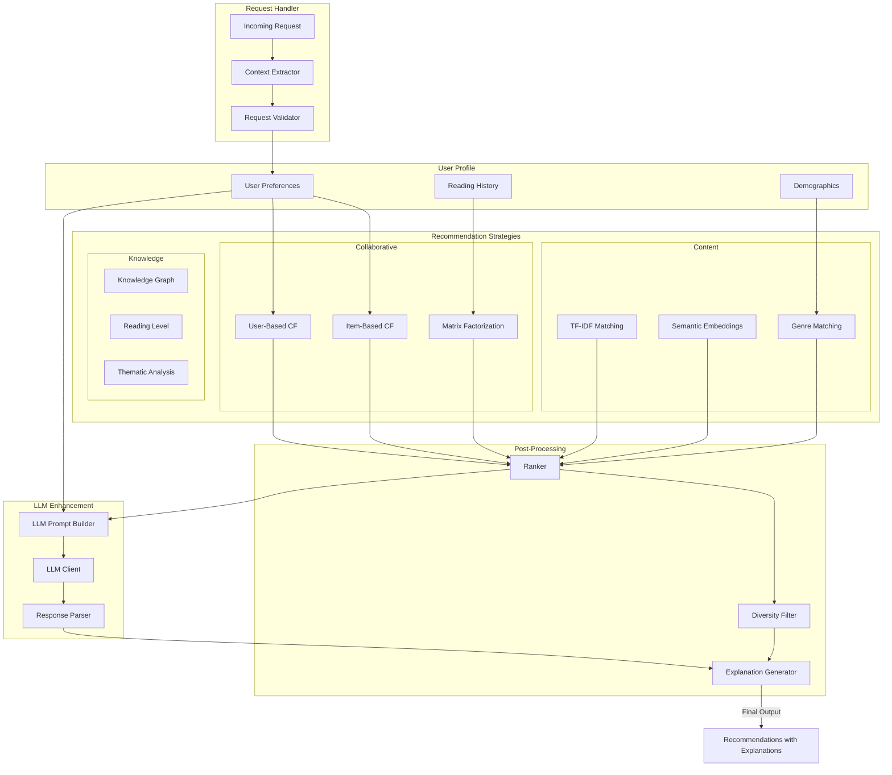
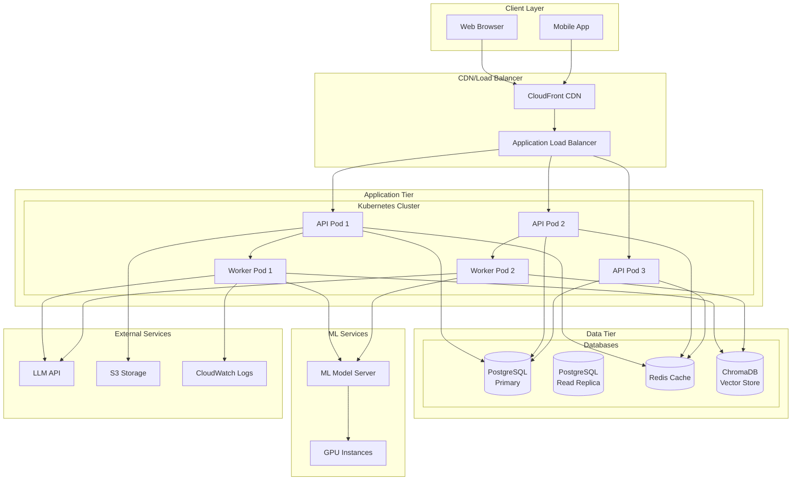
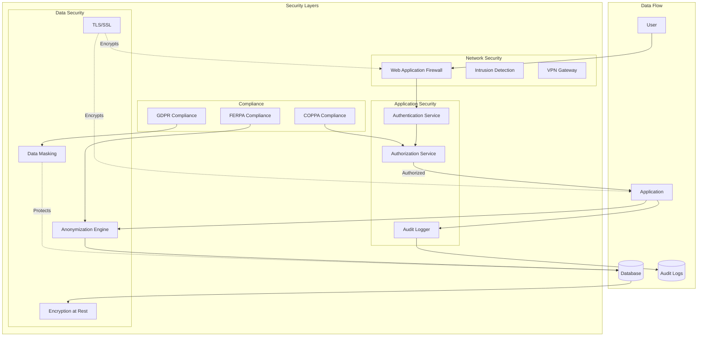
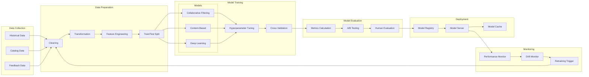

# SmartReads Architecture Diagrams

## System Context Diagram
Shows how SmartReads fits into the school district ecosystem.

## Data Flow Diagram
Illustrates how data moves through the system to generate recommendations.

## Recommendation Engine Architecture
Detailed view of the recommendation engine's internal components.

## Infrastructure Architecture
Shows the deployment and infrastructure components.

## Security Architecture
Illustrates security measures and data protection.

## Machine Learning Pipeline
Details the ML model training and deployment pipeline.

